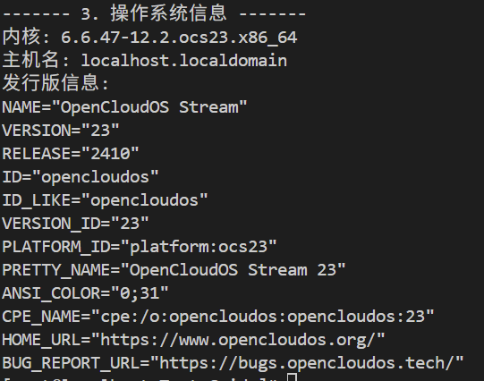
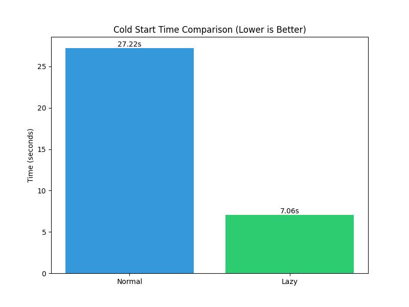
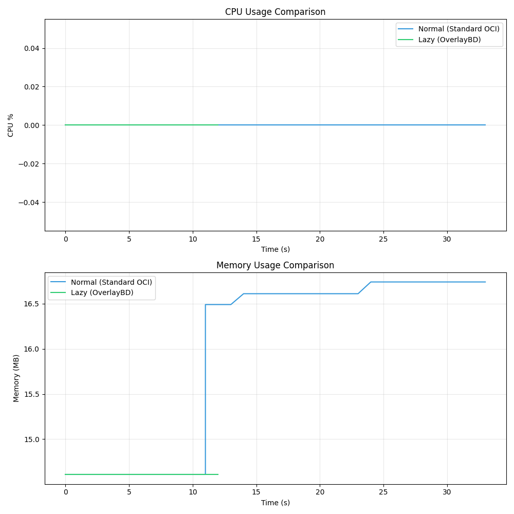
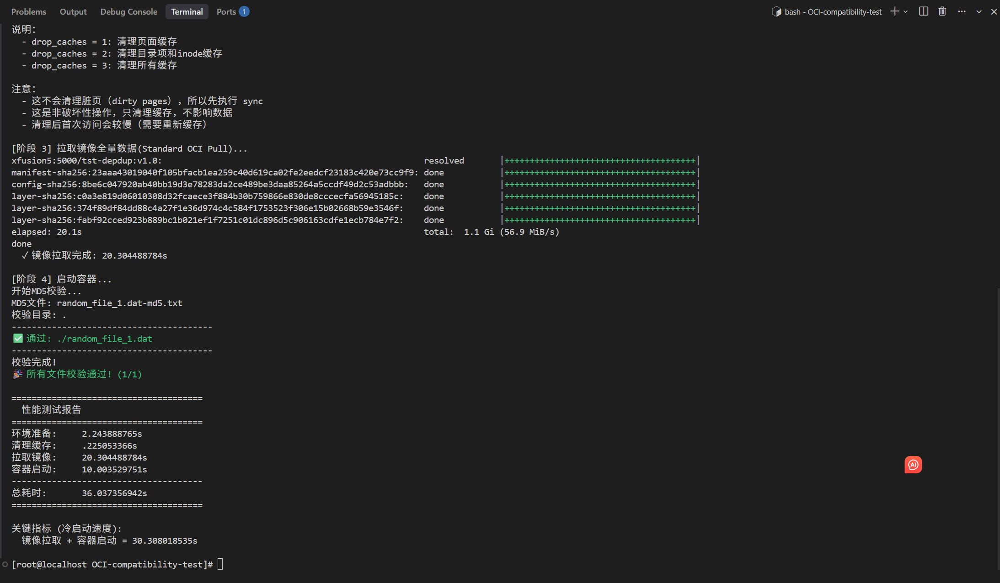
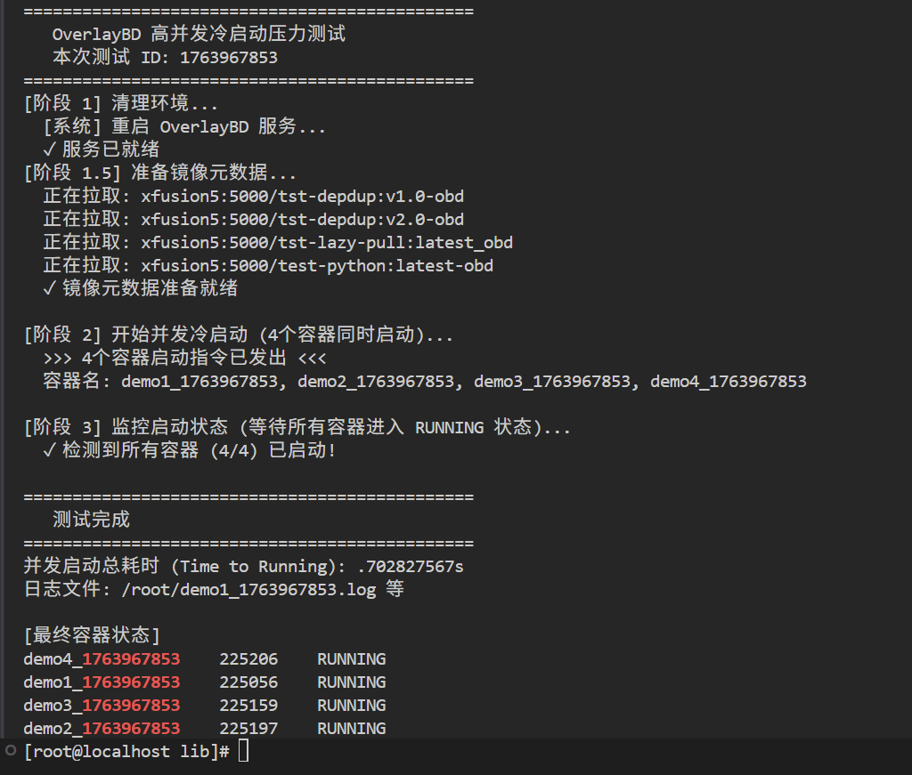

# 2 实验验证

所有测试相关的截图、视频和原始数据均位于 `experiments/` 目录下。
## 2.1 测试环境

使用OpenCloudOS操作系统，符合比赛要求。

## 2.2 测试一：冷启动加速测试

### 目标
验证 OverlayBD 按需加载机制（Lazy Loading）相比传统 OCI 全量下载对容器冷启动速度的提升。

### 测试步骤
1.  **Baseline (OCI)**: 清理缓存，使用标准 OCI 镜像运行，记录冷启动耗时和资源开销。
2.  **OverlayBD**: 清理缓存，使用 OverlayBD 镜像运行（按需加载），记录同等条件下的数据。

### 结果分析

**1. 冷启动耗时对比**
> 如下图所示，OverlayBD 按需加载（绿色）相比普通 OCI 镜像全量下载（蓝色），显著缩短了冷启动时间。

**2. 资源开销对比**
> 下图展示了测试全过程中的资源消耗。OverlayBD 在按需读取数据时，CPU 和内存开销保持在较低水平。
> *注：由于服务器 CPU 性能较强，负载未显著拉高利用率。*

## 2.3 测试二：数据去重测试 (FastCDC)

### 目标
评估引入 FastCDC 分块算法后，CORA 方案在不同数据类型下的去重效率，并与固定大小分块进行对比。

### 测试数据集
- **Random**: 随机数据，模拟不可压缩场景。
- **Pattern**: 模式数据，模拟高重复率场景。
- **Mixed**: 混合数据，模拟真实镜像场景。

### 关键发现 (FastCDC vs 固定分块)

| 数据类型 | 平均空间节省率 | 平均解压缩加速比 | MD5 通过率 |
| :--- | :---: | :---: | :---: |
| 随机数据 (Random) | -0.10% | 8.31× | 100% |
| 模式数据 (Pattern) | 61.51% | 8.58× | 100% |
| **混合数据 (Mixed)** | **72.36%** | **8.79×** | **100%** |

*   **高去重率**：在混合数据场景下，FastCDC 实现了 **72.36%** 的空间节省。
*   **稳定性**：在最差情况（随机数据）下无显著负优化。
*   **完整性**：90 组测试用例 MD5 校验全部通过。

## 2.4 测试三：OCIv1 兼容性测试

### 目标
验证 OverlayBD 环境对标准 OCIv1 镜像的向后兼容性。

### 结果

测试结果表明，标准 OCIv1 镜像可以在 OverlayBD 环境下正常下载并冷启动运行，完全符合预期。

## 2.5 测试四：高并发压力测试

### 目标
评估系统在单节点高并发场景下，同时启动多个 OverlayBD 容器（涉及数据去重和按需下载）的稳定性与性能。

### 测试环境
- **并发数**: 4 个容器同时启动
- **负载**:  所有容器都启动完毕，处于running状态。

### 结果

*   **启动速度**: 仅需约 **0.7秒** 即可完成所有 4 个镜像的并发启动（Time to Running）。
*   **稳定性**: 所有容器均成功进入 Running 状态，未出现 I/O 挂死或服务崩溃。
